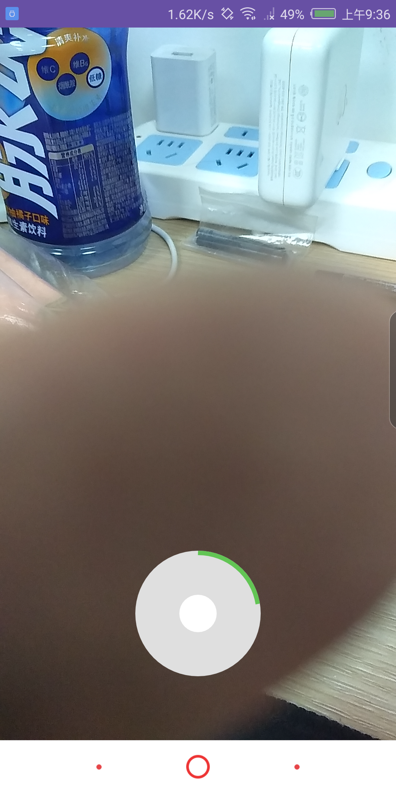

# swRecordVideo
仿微信短视频录制
# 效果图

# 1 如何引入自己的项目
## 1.1 将JitPack存储库添加到您的构建文件中
将其添加到存储库末尾的root（项目） build.gradle中：
~~~
allprojects {
		repositories {
			...
			maven { url 'https://jitpack.io' }
		}
	}
~~~
## 1.2 添加依赖项
lastestVersion = 
~~~
dependencies {
	  implementation 'com.github.qiangzhouliang:download:$lastestVersion'
}
~~~
# 2 如何使用
## 2.1 在application中注册
~~~
QDownloadConfig.init(this)
~~~
## 2.2 在要使用的地方写上如下代码
- 1 java 代码中
~~~
QDownloadAnyModule anyRunnModule = new QDownloadAnyModule(this,findViewById(R.id.tv));
        anyRunnModule.start("http://hcjs2ra2rytd8v8np1q.exp.bcevod.com/mda-hegtjx8n5e8jt9zv/mda-hegtjx8n5e8jt9zv.m3u8", FileUtils.getPath("download").toString() + "/test.mp4");
        anyRunnModule.setOnComplate(new QDownloadIntfComplate() {
            @Override
            public void onComplate(@Nullable DownloadTask task, @Nullable View view) {
                ((TextView)view).setText(task.getFilePath()+"下载完成");
            }
        });
~~~

# 3 版本更新说明
## 3.1 

